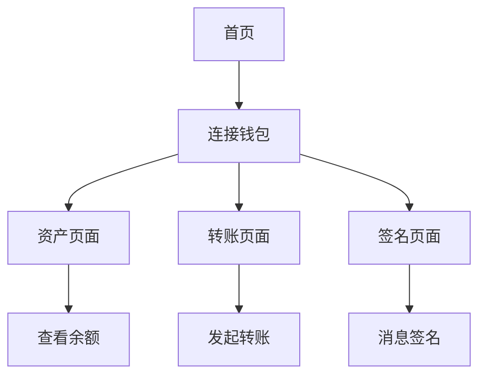

## 1. 产品概述

一个基于Next.js的Web3去中心化应用，集成MetaMask钱包功能。用户可以通过浏览器直接与区块链交互，查看资产信息，进行转账交易和消息签名等操作。

目标用户为加密货币爱好者和Web3初学者，提供简洁直观的区块链交互体验。

## 2. 核心功能

### 2.1 用户角色

| 角色   | 注册方式       | 核心权限                 |
| ---- | ---------- | -------------------- |
| 访客用户 | 无需注册       | 可查看公开信息，无法使用钱包功能     |
| 钱包用户 | MetaMask连接 | 可使用所有Web3功能，包括转账、签名等 |

### 2.2 功能模块

Web3 dApp包含以下主要页面：

1. **首页**: 钱包连接、网络状态、账户信息展示
2. **资产页面**: ETH余额、ERC-20代币余额展示
3. **转账页面**: ETH转账功能
4. **签名页面**: 消息签名验证功能

### 2.3 页面详情

| 页面名称 | 模块名称       | 功能描述                |
| ---- | ---------- | ------------------- |
| 首页   | 钱包连接模块     | 连接MetaMask钱包，显示连接状态 |
| 首页   | 网络信息模块     | 显示当前网络名称、链ID，支持网络切换 |
| 首页   | 账户信息模块     | 显示钱包地址、ETH余额        |
| 资产页面 | ETH余额模块    | 实时显示ETH余额，支持刷新      |
| 资产页面 | ERC-20代币模块 | 查询并显示常见ERC-20代币余额   |
| 转账页面 | 转账表单模块     | 输入接收地址和金额，执行ETH转账   |
| 转账页面 | 交易历史模块     | 显示最近转账记录            |
| 签名页面 | 消息签名模块     | 输入文本消息，使用钱包私钥签名     |
| 签名页面 | 签名验证模块     | 验证签名有效性             |

## 3. 核心流程

### 钱包用户操作流程

1. 用户访问首页 → 点击"连接钱包" → MetaMask弹出授权 → 连接成功显示账户信息
2. 用户查看资产 → 进入资产页面 → 自动查询ETH和代币余额 → 显示余额信息
3. 用户发起转账 → 进入转账页面 → 输入接收地址和金额 → 确认交易 → MetaMask签名 → 交易广播
4. 用户消息签名 → 进入签名页面 → 输入消息内容 → 钱包签名 → 显示签名结果

## 4. 用户界面设计

### 4.1 设计风格

* **主色调**: 深蓝色(#1a1a2e)配合金色(#f39c12)强调色

* **按钮样式**: 圆角矩形，悬停效果，主要操作为渐变色

* **字体**: Inter字体，标题24px，正文16px，小字14px

* **布局**: 卡片式布局，响应式网格系统

* **图标**: 使用Web3相关图标，如钱包、以太坊标志等

### 4.2 页面设计概述

| 页面名称 | 模块名称       | UI元素                  |
| ---- | ---------- | --------------------- |
| 首页   | 钱包连接模块     | 大型连接按钮，显示钱包图标，连接状态指示器 |
| 首页   | 网络信息模块     | 卡片式布局显示网络名称和链ID，下拉选择器 |
| 首页   | 账户信息模块     | 地址复制按钮，余额大字体显示        |
| 资产页面 | ETH余额模块    | 大数字显示，实时更新动画          |
| 资产页面 | ERC-20代币模块 | 代币列表，包含图标、名称、余额       |
| 转账页面 | 转账表单模块     | 输入框验证，金额格式化，确认对话框     |
| 签名页面 | 消息签名模块     | 文本输入区域，签名按钮，结果显示区域    |

### 4.3 响应式设计

采用桌面端优先设计，适配移动端：

* 桌面端：多列布局，功能完整展示

* 平板：双列布局，保持核心功能

* 手机：单列布局，触摸优化，重要功能

