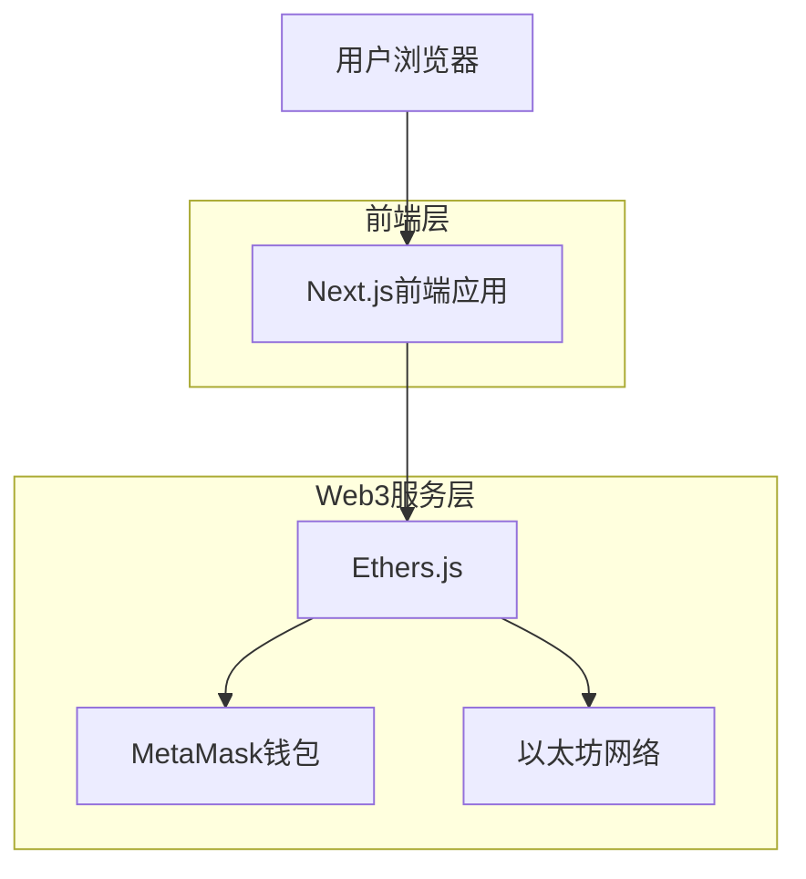
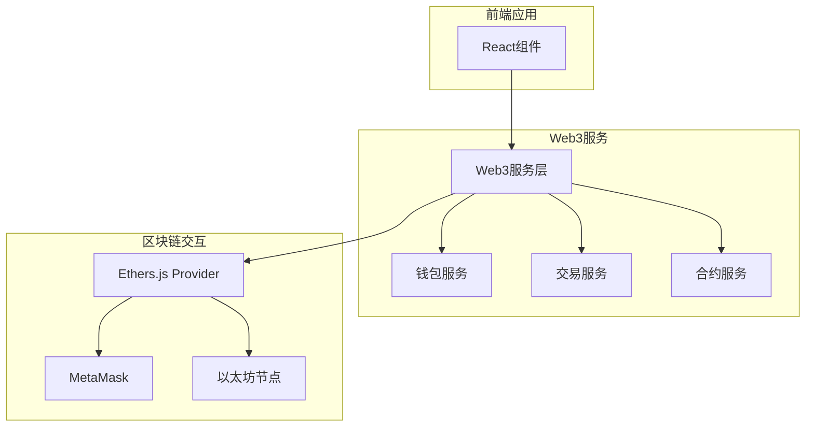

## 1. 架构设计



## 2. 技术栈描述

- **前端**: Next.js@14 + React@18 + TypeScript + TailwindCSS
- **Web3库**: Ethers.js@6
- **钱包集成**: MetaMask
- **初始化工具**: create-next-app
- **后端**: 无（纯前端应用，直接连接区块链）

## 3. 路由定义

| 路由 | 用途 |
|-------|---------|
| / | 首页，钱包连接和网络信息显示 |
| /assets | 资产页面，显示ETH和ERC-20代币余额 |
| /transfer | 转账页面，执行ETH转账功能 |
| /sign | 签名页面，消息签名和验证功能 |

## 4. 核心组件定义

### 4.1 钱包连接相关类型
```typescript
interface WalletInfo {
  address: string;
  balance: string;
  chainId: number;
  network: string;
}

interface ConnectState {
  isConnected: boolean;
  isConnecting: boolean;
  error: string | null;
}
```

### 4.2 转账相关类型
```typescript
interface TransferForm {
  toAddress: string;
  amount: string;
}

interface TransactionResult {
  hash: string;
  from: string;
  to: string;
  value: string;
  gasUsed: string;
  blockNumber: number;
}
```

### 4.3 签名相关类型
```typescript
interface SignMessage {
  message: string;
  signature: string;
  address: string;
}

interface VerifyResult {
  isValid: boolean;
  signer: string;
}
```

## 5. 服务架构



## 6. 核心服务模块

### 6.1 钱包服务 (WalletService)
- 连接/断开MetaMask钱包
- 获取账户地址和余额
- 监听账户和链变化事件
- 网络切换功能

### 6.2 交易服务 (TransactionService)
- ETH转账功能
- 交易状态监听
- Gas费用估算
- 交易历史记录

### 6.3 合约服务 (ContractService)
- ERC-20代币余额查询
- 常见代币合约交互
- 代币信息缓存

### 6.4 签名服务 (SignService)
- 消息签名功能
- 签名验证功能
- 签名结果存储

## 7. 状态管理

使用React Context进行全局状态管理：
- Web3Context: 管理钱包连接状态
- BalanceContext: 管理资产余额信息
- TransactionContext: 管理交易状态和历史